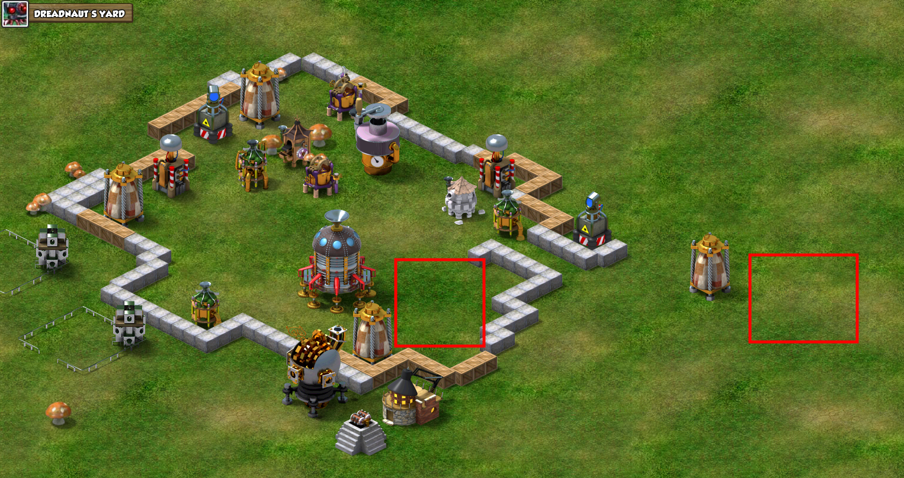

# Backyard Monsters Refitted Beginners Guide

## Table of Contents
- [Backyard Monsters Refitted Beginners Guide](#backyard-monsters-refitted-beginners-guide)
  - [Table of Contents](#table-of-contents)
  - [Getting Started](#getting-started)
      - [Get Workers](#get-workers)
      - [Upgrade Storage Capacity](#upgrade-storage-capacity)
      - [Farm Resources](#farm-resources)
      - [Takeover First Outpost](#takeover-first-outpost)
  - [What's Next?](#whats-next)
      - [Take over 5 more outposts and build kits](#take-over-5-more-outposts-and-build-kits)
      - [Upgrade flinger for more base range](#upgrade-flinger-for-more-base-range)
      - [Unlock Inferno](#unlock-inferno)
  - [Tips and Tricks](#tips-and-tricks)
    - [Relocating](#relocating)
    - [Quests](#quests)
    - [Shiny](#shiny)
    - [Events](#events)
    - [Wild Tribes](#wild-tribes)
    - [Inferno](#inferno)
    - [Champions](#champions)
    - [Attacking](#attacking)
    - [Defense](#defense)
    - [Outposts](#outposts)
    - [Misc.](#misc)
  - [Wild Tribe Loot Table](#wild-tribe-loot-table)

## Getting Started
If you are wondering how to get up and running as fast as possible, you came to the right place.  

#### Get Workers
The first thing you want to do, as you are going through the tutorial, is buy workers. With the starting 1500 shiny, you can buy 2 workers. 3 Total workers is enough to get started, but you will want at least 4 ASAP. Wait until the 20th of the month and you can afford a 4th one. Everyone receives 400 shiny every month on the 20th. 

#### Upgrade Storage Capacity  
After you finish the tutorial, rush to upgrade your silos. You will need at least 1 million base max capacity storage to take over your first outpost. 

#### Farm Resources
There are 2 super easy ways you can get enough resources for this. Either attack some level 28 or level 32 Dreadnauts, or complete some upgrade quests. If you do not have any low level Dreadnauts or Legionnaires around, consider [relocating](#relocating).
1. You will have a few Pokies in your housing from the tutorial. Originally, there would be another part of the tutorial that leads you to attack some wild monster tribes, but that is not implemented in BYM Refitted. Instead, you can use these Pokies to attack Dreadnauts for easy resources. 3-4 Pokies can take out the whole silo that sits outside the base in a few minutes. Just attacking it should net you a few thousand of each resource, and killing it completely will give well over 100,000 of each resource except goo, so you may want to save the killing for later after upgrading a silo or two.
    - Here are the spots you can attack 
    - 
2. Quests are pretty easy also. Upgrade one of each resource gatherer to maybe level 3. You will also get resources from upgrading your silo. 

You will want to upgrade the Town Hall to at least level 3, and 2 silos to at least level 6. A third silo can be upgraded but doesn't have to reach 6 to give you 1 million storage capacity. If you are lucky, this requirement is halved to 500,000 and you can postpone some silo upgrades. This is because hexes direcly beside your main yard hex are half off!

#### Takeover First Outpost
Once you have 1 million storage capacity, you are ready to takeover something. Level 25 Legionnaires are the easiest and cheapest to takeover. If you were lucky, there will be a level 25 Legionnaire directly beside your main yard. You can take that over for half the normal cost, so 500,000 of each resource. You can swarm them with Pokeys or Octo-oozes if you decided to unlock that already. Make sure to bring their yard status to at least 90% damaged to take it over. If you need resources, don't forget to attack Dreadnauts in the area for free. It may take a few tries to get enough goo. 

## What's Next?
Ok, now you have your first outpost! Each outpost grants you 2 million more max capacity for all resources, so you should now have 3 million storage capacity. It is empty now, but you can build up to 4 of each resource generator, and it will auto-bank (automatically go straight into your storage). 

#### Take over 5 more outposts and build kits
Attack and loot until you have enough to take over 5 more outposts. At this point you should have 6 outposts with a total capacity of at least 13 million. You can now start building kits on your outposts. When building a kit, it replaces all buildings already existing on the outpost. 

The easiest targets for resources are level 28 and level 32 Dreadnauts, followed by any Legionnaire.

#### Upgrade flinger for more base range
You should begin upgrading your flinger if you can afford it. Each level gives you more range to attack from your main yard. If you want to attack further, you need to take over outposts and build and upgrade the flinger on those outposts. Outposts have a rmax ange of 4 hexes instead of 10, unlike your main yard

#### Unlock Inferno
- Once you reach Town Hall level 5, Moloch will start attacking you. After 5 attacks, you can start attacking him back. Once you reach the end of his Descent bases, you can start building an Inferno base. It is similar to your main yard, but a whole different set of resources, and the building levels are maxed out at lower levels. 
- [Tips on Inferno](#inferno)

## Tips and Tricks

### Relocating
- If you find you are surrounded by higher levels or you do not like your location or server, you can relocate by recycling your map room and rebuilding it. It is super cheap: 2,000 twigs and 2,000 pebbles and only takes 15 minutes to build. You will randomly be placed in a random server in a random location. 
- Your server name is the name of the player at 0x0
- Server Styx is the oldest
- Servers OP and LOL are generally more pvp if you like to war
- Server DarkKnight is still chill for now, but this may change

### Quests
- The quests to take down wild tribe town halls do not work. In the original game, there was a map room version 1 where it could be completed. In BYM Refitted, we all start out in map room version 2, so the quest cannot be completed as of the writing of this guide.

### Shiny
- Shiny quests do not actually give shiny. It will subtract one instead.
- Everyone is part of the D.A.V.E. club. Everyone gets 400 shiny on the 20th of every month. 
- There is no way to buy shiny.
- Mushrooms grow back every day. They have a chance to give either 3 or 8 shiny.

### Events
- As of the writing of this guide, there are 2 events
  1. Wild Monster Invasion 1
  2. Wild Monster Invasion 2
- Each have 30 waves, and rewards you a totem to display depending on how far you made it
  - Since it repeats, if you make it further in a later iteration of the event, the totem is updated rather than duplicated.
- There are bonus waves also if you feel like taking them on. 
- Each event will run on the 10th of every month, alternating which event each month.

### Wild Tribes
- The somewhat daily or weekly wild monster attacks on your base can be somewhat influenced by the 3 options at the end of the attack. Friends option makes it less often, and the taunt makes it more often.
  - There is no positive or negative for this as they cannot steal your resources yet. But the repairing may be annoying
- Wild tribes will heal up fully after 12 hours of no attacking/viewing. To reset them, you must *View* their base. Attacking will not reset the base, but will instead refresh the 12 hour timer. 
- Easy targets are level 28/32 Dreadnauts and any level Legionnaire
  - Legionnaire tribes defenses are all Level 1 no matter what level, and they do not have traps either. They can be taken down by a swarm of Octo-oozes.
- Abunakki tribes have the highest level defenses. Avoid them until you are stronger
  - They have Eyeras and Fangs in their bunkers, so make sure to lure out the Eyeras to suicide before the full attack. 
- Kozu tribes have heavy traps. They deal BIG damage to your bigger monsters (like your champion)

### Inferno
- Moloch starts attacking your bases (up to 5 times) once you reach Town Hall level 5
- If you close out the game, the attack does not kill your base
  - Not confirmed yet if the attack is postponed or if it is skipped

### Champions
- Drull is the best starter champion to get started taking over outposts. His base attack at level 1 is equal to 50 Pokies.
  - If you have a juicer, you can juice Drull at any level after attacks and hatch a new one at full HP at level 1. If you have not invested much into Drull yet, this is a quick way to reset him to full HP. This can be very useful in taking down most of Moloch's Descent Inferno bases
- Korath is unlocked at town hall 7, and he is the best for base defense
- Krallen is unlocked at town hall 6. He buffs the amount of loot you get
  - This is buffed such that if your max storage capacity is 50 million resources, He allows you to loot over the cap to around 70 million instead. He does not directly multiply your loot by 30% from attacks 
- Fomor is great at buffing for Main Yard attacks and good at aerial attacks later when it grows wings

### Attacking
- Build a catapult! You can repeatedly send 10,000 twigs/pebbles to knock down towers
- Flinging putty in the catapult buffs your monsters. Lower amounts of putty give more armor. Higher ammounts of putty give more speed.
- Upgrade your flinger for a larger range around your main base, up to 10 hexes away.
- Your main yard has up to a 10 tile fling radius. If you want to attack further, you must use your outposts. You can build housings and flingers on your outposts. Outposts have a max range of 4 hexes.
- You can also move your main base location for 30 million of every resource onto an outpost you already own.

### Defense
- The best monsters to put in a bunker are Eyeras and Daves with rockets

### Outposts
- Each outpost gives 2 million max storage capacity for each resource. 
- The hexes directly beside your main base cost half the normal amount to takeover. 
- There is a resource production buff for the lower altitude hexes. They usually show up as sand tiles. There is a tower range buff for hexes on the higher altitude hexes. These usually show up as green/mountain tiles.
- When building a kit, it replaces all buildings already existing on the outpost. 

### Misc.
- When you start your account, you have a 7 day protection bubble. This cannot be removed, so you are free to attack wild tribes and other players without losing the protection. 
- You may remember monsters regenerating HP rather than remaking them every time after an attack. This is a feature of Map Room Version 3. This is currently not implemented, but the devs are working on it. It will be announced when ready.
- The yard planner allows for better placement options of buildings and structures. As you may notice when moving buildings around, it is in incements of diagonals. There are no direct ups and downs, but you can get around that with the yard planner.
- 

## Wild Tribe Loot Table
|Tribe|Level|Loot (in millions)|Twigs|Pebbles|Putty|Goo|Takeover Cost (in millions)|
|-|-|-|-|-|-|-|-|
|Legionnaire|25||0.07|0.2|0.2|0.03|1|
|Legionnaire|29||0.07|0.2|0.2|0.03|1.5|
|Legionnaire|33||2.8|2.8|2.8|0.4|3.75|
|Legionnaire|37||2.8|2.8|2.8|0.4|6|
|Legionnaire|41||3.8|3.8|3.8|0.4|8.25|
|
|
|
|
|
|
|
|
|
|Abunakki|27||1.4|1.4|1.4|0.24|1|
|Abunakki|31||1.45|1.45|1.45|0.24|2.75|
|Abunakki|35||||||5|
|Abunakki|39||||||7.25|
|Abunakki|43||||||9.5|
|
|
|
|
|
|
|
|
|
|Dreadnaut|28||||||1|
|Dreadnaut|32||||||3.25|
|Dreadnaut|36||||||5.5|
|Dreadnaut|40||||||7.75|
|Dreadnaut|44||2.85|2.84|2.95|0.42|10|
|
|
|
|
|
|
|
|
|
|Kozu|30||||||2.25|
|Kozu|34||||||4.5|
|Kozu|38||||||6.75|
|Kozu|42||||||9|
