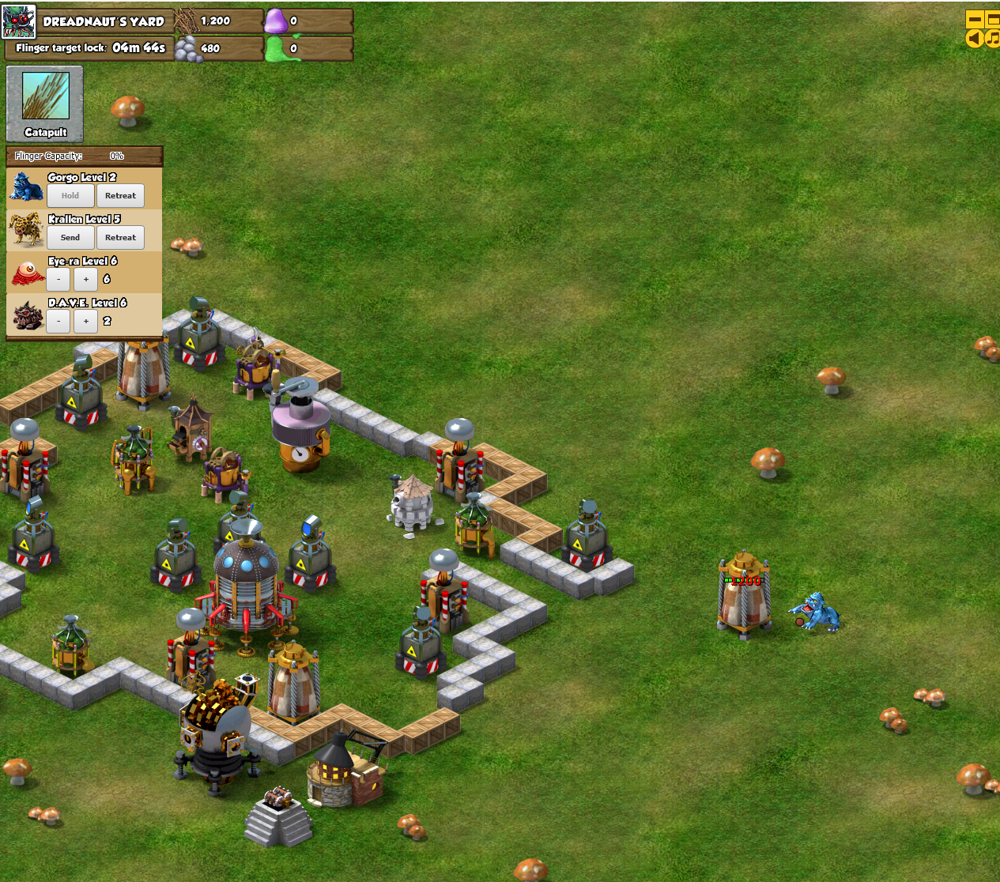

# Backyard Monsters Refitted Beginners Guide

## Table of Contents
- [Backyard Monsters Refitted Beginners Guide](#backyard-monsters-refitted-beginners-guide)
  - [Table of Contents](#table-of-contents)
  - [Getting Started](#getting-started)
    - [1. Get Workers](#1-get-workers)
    - [Map Room 1](#map-room-1)
    - [Map Room 2](#map-room-2)
      - [Takeover First Outpost](#takeover-first-outpost)
      - [What's Next?](#whats-next)
      - [Take over 5 more outposts and build kits](#take-over-5-more-outposts-and-build-kits)
      - [Upgrade flinger for more base range](#upgrade-flinger-for-more-base-range)
    - [Map Room 3](#map-room-3)
    - [Unlock Inferno](#unlock-inferno)
  - [Tips and Tricks](#tips-and-tricks)
    - [Relocating](#relocating)
    - [Quests](#quests)
    - [Shiny](#shiny)
    - [Events](#events)
    - [Wild Tribes](#wild-tribes)
      - [Map Room 2 Tribes](#map-room-2-tribes)
    - [Inferno](#inferno)
    - [Champions](#champions)
    - [Attacking](#attacking)
    - [Catapult](#catapult)
    - [Defense (Map Room 2)](#defense-map-room-2)
    - [Defense (Map Room 3)](#defense-map-room-3)
    - [Outposts (Map Room 2)](#outposts-map-room-2)
    - [Outposts (Map Room 3)](#outposts-map-room-3)
    - [Misc.](#misc)
  - [Map Room 2 Wild Tribe Loot Table (in millions)](#map-room-2-wild-tribe-loot-table-in-millions)
  - [Map Room 3 Tables](#map-room-3-tables)

## Getting Started
If you are wondering how to get up and running as fast as possible, you came to the right place.  

** Warning: ** When attacking, you WILL lose your beginner protection shield.  

### 1. Get Workers
The first thing you want to do, as you are going through the tutorial, is buy workers. With the starting 1500 shiny, you can buy 2 workers. 3 Total workers is enough to get started, but you will want at least 4 ASAP. Wait until the 20th of the month and you can afford a 4th one. Everyone receives 400 shiny every month on the 20th.  

### Map Room 1
- How to change maps (attack targets)
  - It is automatically refreshed every 2 weeks
  - If you level up and lower levels disappear off your map, you will have fewer targets. But once you lose enough targets, it auto refreshes the list with new ones. 
  - If you have 0 targets, you need to submit a ticket on discord. 
  - You can also remove someone by attacking them 10 times within 24 hours. After 4 attacks, it will trigger a 1 hour protection though, so it will take a few hours. You can use this method to get rid of someone who is harassing you. It does not matter if you deal damage on the attack. But if you deal a lot of damage, you will trigger protection sooner and it will last longer. So ideally, you don't do much damage. After 10 attacks, both of you should be gone from each other's lists.
- Meta Champion:
  - Fomor
- How to unlock map room 2 and 3:
  - Upgrade Town Hall to 6

Not much to tell about this map room. It was the first map room and is for beginners. You can probably expect a lot of attacks as soon as your beginner protection runs out.  

### Map Room 2
- How to change maps/location
  - See [relocating](#relocating) Your server and location on the map is completely randomized when you build/upgrade your map room. Recycle and rebuild it to change locations. It takes 15 minutes to build, or 10 if you wait for the free 5 minutes timer. 
- Meta Champion:
  - Drull
  - Korath

This is probably the most chill map room version now, as long as you don't step on any toes. 

There are a few easy ways to farm resources here. You can attack level 28 and 32 Dreadnauts for a free silo.

All Legionnaires have level 1 defenses. 

#### Takeover First Outpost
To get started taking over outposts, you need at minimum 1 million storage capacity. By now, you should have enough if you have been upgrading your silos. Level 25 Legionnaires are the easiest and cheapest to takeover. You can swarm them with Pokeys or Octo-oozes, or really any monster. The yard must be damaged to at least 90% to be able to be taken over. 

If you need resources, don't forget to attack Dreadnauts in the area for free. It may take a few tries to get enough goo this way, or you can attack a higher level kozu. The bottom left has a silo you can reach easily for 500,000 goo. 

Outposts directly adjacent to your main yard have the cost cut in half.

#### What's Next?
Ok, now you have your first outpost! Each outpost grants you 2 million more max capacity for all resources. It is empty now, but you can build up to 4 of each resource generator, and it will auto-bank (automatically go straight into your storage). 

#### Take over 5 more outposts and build kits
Attack and loot until you have enough to take over 5 more outposts. At this point you should have 6 outposts with a total capacity of at least 13 million. You can now start building kits on your outposts. When building a kit, it replaces all buildings already existing on the outpost. Check the [table](#wild-tribe-loot-table-in-millions) at the bottom of this guide for loot and costs of each tribe at each level. 

#### Upgrade flinger for more base range
You should begin upgrading your flinger if you can afford it. Each level gives you more range to attack from your main yard. If you want to attack further, you need to take over outposts and build and upgrade the flinger on those outposts. Outposts have a max range of 4 hexes instead of 10, unlike your main yard

### Map Room 3
- How to relocate:
  - Click on your Town Hall in your base, it will have the option to move
- Meta Champion:
  - Fomor

This is the most bloodthirsty map room. There is not a lot to take compared to Map Room 2, and players can just pay extra resources to attack anywhere on the map. This is not a bad place to set up if you want to at a low level though, but beware. Once you hit level 30, you can no longer attack resource outposts of levels 10 and 20. 

### Unlock Inferno
- Once you reach Town Hall level 5, Moloch will start attacking you. After 5 attacks, you can start attacking him back. Moloch does not attack you anymore after this, not even in the inferno base. Once you reach the end of his Descent bases, you can start building an Inferno base.
- It is similar to your main yard, with a few changes
  - Resources are a completely different set, but they do the same thing
  - Most building levels are maxed out at lower levels.
  - There is only 1 worker
  - The monsters unlocked have very high stat values. They also deal extra damage to their preferred target, if the preferred target is not "anything". Balthazars deal 3x damage to other monsters
- [Tips on Inferno](#inferno)

## Tips and Tricks

### Relocating
- If you find you are surrounded by higher levels or you do not like your location or server, you can relocate by recycling your map room and rebuilding it. It is super cheap: 2,000 twigs and 2,000 pebbles and only takes 15 minutes to build. You will randomly be placed in a random server in a random location. 
- Generally, your server name is the name of the player at 0x0. You can go to the [leaderboard](https://www.bymrefitted.com/leaderboards) to see the servers in order in the dropdown menu. If someone takes over the spot at 0x0 it may take some time for the page to update to the new name. 
- World 1 - Conquest
- World 2 - 4hahahas
- World 3 - Gladios
- World 4 - JediMuffin
- You can start out in any world if you have a good location.
- Disclaimer: I do not update this guide constantly. Check the leaderboard in the launcher or on the website for the up to date server names.

### Quests
- The quests to take down wild tribe town halls do not work on Map Room 2. They should be able to be completed in Map Room 1 and Map Room 3. 
  - In Map Room 3, I think Strongholds can count for this.

### Shiny
- Everyone is part of the D.A.V.E. club. Everyone gets 400 shiny on the 20th of every month. 
- There is no way to buy shiny.
- Mushrooms grow back every day. They have a chance to give either 3 or 8 shiny.

### Events
- As of the writing of this guide, there are 2 events
  1. Wild Monster Invasion 1
  2. Wild Monster Invasion 2
- Each have 30 waves, and rewards you a totem to display depending on how far you made it
  - Since it repeats, if you make it further in a later iteration of the event, the totem is updated rather than duplicated.
- There are bonus waves also if you feel like taking them on. 
- Each event will run on the 10th of every month, alternating which event each month.
- This is so nobody misses out on it.

### Wild Tribes
- The somewhat daily or weekly wild monster attacks on your base can be somewhat influenced by the 3 options at the end of the attack. Friends option makes it less often, and the taunt makes it more often.
#### Map Room 2 Tribes
- Wild tribes will heal up fully after 12 hours of no attacking/viewing. To reset them, you must *View* their base. Attacking will not reset the base, but will instead refresh the 12 hour timer. 
- Easy targets are level 28/32 Dreadnauts and any level Legionnaire
  - Legionnaire tribes defenses are all Level 1 no matter what level, and they do not have traps either. They can be taken down by a swarm of Octo-oozes.
- Abunakki tribes have the highest level defenses. Avoid them until you are stronger
  - They have Eyeras and Fangs in their bunkers, so make sure to lure out the Eyeras to suicide before the full attack. 
- Kozu tribes have heavy traps. They deal BIG damage to your bigger monsters (like your champion)

### Inferno
- Moloch starts attacking your bases (up to 5 times) once you reach Town Hall level 5
- If you close out the game when the monster preview pops up, the attack is skipped and your base is not damaged. 
- At the lower levels of descent, Teratorns and a flying Fomor are great at taking the bases out. 
- You can also use a level 1 Drull and juice/respawn him to spam him. This takes an incredibly long time the deeper you are.
- Champions only take damage from the towers, not the heat from the environment, so you can juice a level 1 champion after every attack to instant hatch a fully healed one.

### Champions
- Drull is the best starter champion to get started taking over outposts. His base attack at level 1 is equal to 50 Pokies.
  - If you have a juicer, you can juice Drull at any level after attacks and hatch a new one at full HP at level 1. If you have not invested much into Drull yet, this is a quick way to reset him to full HP. This can be very useful in taking down most of Moloch's Descent Inferno bases
- Korath is unlocked at town hall 7, and he is the best for base defense
- Krallen is unlocked at town hall 6. He buffs the amount of loot you get
  - This is buffed such that if your max storage capacity is 50 million resources, He allows you to loot over the cap to around 70 million instead. He does not directly multiply your loot by 30% from attacks 
- Fomor is great at buffing for Main Yard attacks and good at aerial attacks later when it grows wings

### Attacking
- Build a catapult! Even at lower levels, you can repeatedly send 10,000 twigs/pebbles to knock down towers
- Flinging putty in the catapult buffs your monsters. Higher amounts of putty give more armor and more speed.
  - The wording for armor is misleading. 10,000 putty will give 20% speed and 20% damage mitigation. They still take 80% damage, it is not 80% damage blocked.
- Upgrade your flinger for a larger range around your main base
  - up to 10 hexes away on Map Room 2
  - up to 12 hexes away on Map Room 3
- For Map room 2, your main yard has up to a 10 tile fling radius. If you want to attack further, you must use your outposts. You can build housings and flingers on your outposts. Outposts have a max range of 4 hexes.
- You can also move your main base location for 30 million of every resource onto an outpost you already own.
- For Map room 3, you can pay resources to attack anywhere on the map. The price depends on your level and the shortest distance from the target to your closest range edge. 

### Catapult
- The catapult can be buggy and fire prematurely.
- You can get around this by clicking and dragging
  - Click and drag from the selection box to where you want to fire
  - Or Click and drag from the selection box back up to the catapult box, the one you clicked on initially at the top left. This will make sure it does not fire, and will allow you to still click and drag to navigate map before clicking once to fire. 

### Defense (Map Room 2)
- In my opinion, The best monsters to put in a bunker are Eyeras and Daves with rockets
- Level 1 bunker I usually put 2 Daves, 1 Eyera
- Level 2 bunker I usually put 2 Daves, 2 Eyera
- Level 3 bunker I usually put 3 Daves, 1 Eyera
- Level 4 bunker I usually put 3 Daves, 3 Eyera
- If facing the event wild monster waves, you might want to replace these with Octo-oozes or a large number of other monsters, because at later waves, they are completely immune for 30 seconds. So having a large number of monsters to delay them will be ideal.

### Defense (Map Room 3)
- Bunkers are no longer 660 max capacity. They are 400 max capacity, and have 5 total levels instead of 4. They are much weaker, and that capacity comes out of your housings storage. By this I mean you can have 2000 housing space. Building a bunker does not get you extra housing space, and the monsters moved from the housing into the bunker reserve the space in both bunker and housing, so a bunker at 400 capacity filled up makes your housing effectively 1600 space. As such, a lot of players forget to load up their housings because they use the same monsters to attack. 

### Outposts (Map Room 2)
- Each outpost gives 2 million max storage capacity for each resource. 
- The hexes directly beside your main base cost half the normal amount to takeover. 
- There is a resource production buff for the lower altitude hexes. They usually show up as sand tiles. There is a tower range buff for hexes on the higher altitude hexes. These usually show up as green/mountain tiles.
- When building a kit, it replaces all buildings already existing on the outpost. 

### Outposts (Map Room 3)
- Outposts lvl 10: 3,600 each resource per hour | 175,000 additional resource capacity | 2 cell attack range
- Outposts lvl 20: 7,200 each resource per hour | 350,000 additional resource capacity | 3 cell attack range
- Outposts lvl 30: 18,000 each resource per hour | 1,000,000 additional resource capacity | 4 cell attack range
- Outposts lvl 40: 41,400 each resource per hour | 2,000,000 additional resource capacity | 5 cell attack range
- Outposts lvl 50: 82,800 each resource per hour | 4,000,000 additional resource capacity | 6 cell attack range

### Misc.
- When you start your account, you have a 7 day protection bubble. This WILL be removed on attacking anything.
- Protection on outposts (Map Room 2 only) will only be removed if you perform an attack that uses any of the monsters on that outpost. 
- Map Room 3 monsters heal after a battle instead of being consumed in the attack
- Map Room 3 outposts do not get protection after attacks
  - Map Room 3 outposts will have auto-repair trigger only if you enter the outpost after taking it over. This means when other players attack your outpost, it will start to heal automatically after the attack ends. 
  - Autobank goes past max capacity of resources
- The yard planner allows for better placement options of buildings and structures. As you may notice when moving buildings around, it is in incements of diagonals. There are no direct ups and downs, but you can get around that with the yard planner. Those positions that are normally not possible via manual placement may be buggy if you use the yard planner to put things in those positions.

## Map Room 2 Wild Tribe Loot Table (in millions)
|Tribe|Level|Loot|Twigs|Pebbles|Putty|Goo|Takeover Cost|
|-|-|-|-|-|-|-|-|
|Legionnaire|25||0.07|0.2|0.2|0.03|1|
|Legionnaire|29||0.07|0.2|0.2|0.03|1.5|
|Legionnaire|33||2.8|2.8|2.8|0.4|3.75|
|Legionnaire|37||2.8|2.8|2.8|0.4|6|
|Legionnaire|41||3.8|3.8|3.8|0.4|8.25|
|
|
|
|
|
|
|
|
|
|Abunakki|27||1.4|1.4|1.4|0.24|1|
|Abunakki|31||1.45|1.45|1.45|0.24|2.75|
|Abunakki|35||2.8|2.8|2.8|0.3|5|
|Abunakki|39||2.8|2.8|2.8|0.3|7.25|
|Abunakki|43||2.8|2.8|2.8|0.3|9.5|
|
|
|
|
|
|
|
|
|
|Dreadnaut|28||2.1|2.1|2.1|0.35|1|
|Dreadnaut|32||2.1|2.1|2.1|0.35|3.25|
|Dreadnaut|36||2.8|2.8|2.9|0.4|5.5|
|Dreadnaut|40||2.8|2.8|2.9|0.4|7.75|
|Dreadnaut|44||2.8|2.8|2.9|0.4|10|
|
|
|
|
|
|
|
|
|
|Kozu|30||2.8|2.8|2.8|0.3|2.25|
|Kozu|34||2.8|2.8|2.8|0.3|4.5|
|Kozu|38||4|4|4|1.9|6.75|
|Kozu|42||4|4|4|1.9|9|

## Map Room 3 Tables
|Structure|level|Loot|Twigs|Pebbles|Putty|Goo|range|autobank|
|-|-|-|-|-|-|-|-|
|Outpost|10|-|-|5,670|5,670|5,670|5,670|
|Outpost|20|-|-|120,000|120,000|120,000|120,000|
|Outpost|30|-|-|1,450,000|1,450,000|1,350,000|1,450,000|
|Outpost|40|-|-|1,600,000|1,600,000|1,500,000|1,600,000|
|Outpost|50|-|-|-|-|-|-|

|Structure|level|range|Extra Monster Damage|Extra Tower Damage|
|Stronghold|30|0|10|10|10|
|Stronghold|40|0|20|20|20|
|Stronghold|50|0|30|30|30|

|Structure|Level|
|Defender|5|
|Defender|10|
|Defender|15|
|Defender|20|
|Defender|25|
|Defender|30|
|Defender|35|
|Defender|40|
|Defender|45|
|Defender|50|

|Tribe|Level|Loot|Twigs|Pebbles|Putty|Goo|
|Kozu|45|
|Kozu|50|
|Kozu|45|
|Kozu|50|
|Kozu|45|
|Kozu|50|
|Kozu|45|
|Kozu|50|
